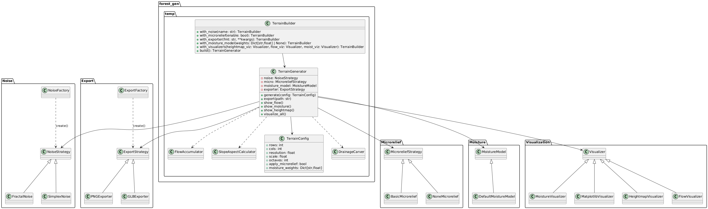

# forest-gen

Our scene generation module.

## Installation

Run the ```install.sh``` script if you are on a Linux system. May Ritchie have
mercy on thy soul if you want to run this on Windows.

The automatic installation won't install Isaac Lab, a necessary element for
getting this running. However, you may well use the mesh generation and
noise function without installing Isaac Lab, for ease of development
there is no overarching facade module, as such Python won't mind as long as
you stray from using modules importing Isaac Lab stuff. More specifically,
the ```heightmap``` module is written with no Isaac Lab imports and may be
tested separately.

## Heightmap

The underlying terrain is generated using
[OpenSimplex](https://en.wikipedia.org/wiki/OpenSimplex_noise) noise. It
suposedly is a superior iteration on Perlin noise.

## Assets

Trees for rudimentary simulation can be found under this address:
[TreesPackage](https://drive.google.com/file/d/1YJbbOOK97fa1lHPxYOv-jeBEiVdRrioW/view?usp=sharing)


## Terrain Generation Pipeline

The terrain generator is built using a fluent builder that assembles noise, microrelief, moisture, export and visualization strategies. `TerrainGenerator` coordinates these components according to a `TerrainConfig` and utilities like `FlowAccumulator` and `SlopeAspectCalculator` to carve drainage and compute hydrology. The diagram below shows the main classes involved.



## Forest Generation

`ForestGenerator` can optionally take a `TerrainGenerator` (or its
moisture array and resolution) when built. Each species' viability map
is then multiplied by terrain moisture at the queried coordinates,
allowing plants to thrive more in wetter areas.
